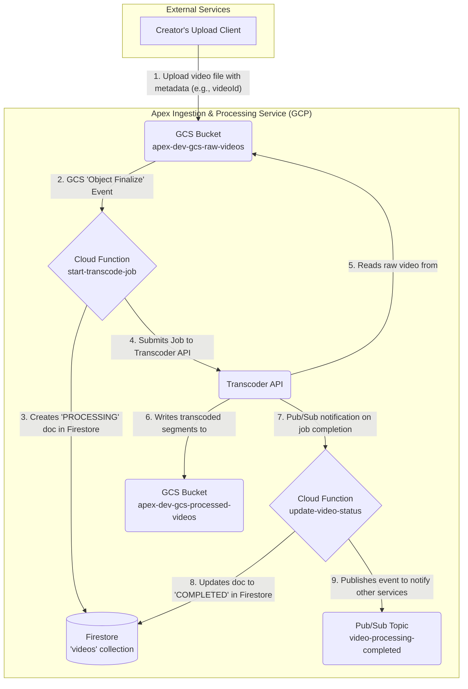
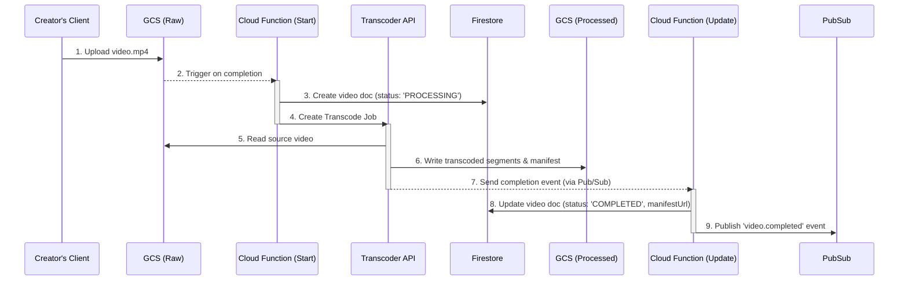

# Design Document: Apex Video Ingestion & Processing Service

- **Document Version:** 1.0
- **Status:** DRAFT
- **Owner:** @AmithSAI007 (Lead Engineer)
- **Date:** 2026-01-16

---

## 1. Overview & Scope

This document outlines the design for the **Video Ingestion & Processing Service**, a core component of **Project Apex**. This service is responsible for receiving raw video uploads, processing them into standard streaming formats, and preparing them for delivery.

This is a backend, event-driven service with no direct user-facing API. It serves as the foundational "assembly line" for all video content on the platform.

### 1.1. In Scope

- Providing a secure destination for raw video uploads.
- Triggering an asynchronous transcoding workflow upon successful upload.
- Using the GCP Transcoder API to convert videos into multiple resolutions in an adaptive bitrate format (HLS).
- Storing the processed video segments and manifests in a dedicated storage bucket.
- Updating a central database (Firestore) with the status of the video asset (`PROCESSING`, `COMPLETED`, `FAILED`).
- Publishing an event to a Pub/Sub topic upon successful completion to notify downstream services.

### 1.2. Out of Scope

- Creator-facing upload UI/API (This is a separate service that will use this pipeline).
- Video playback and Content Delivery Network (CDN) integration.
- Thumbnail generation (This will be a similar but separate workflow).
- User authentication and authorization for uploads.
- Analytics on video processing times or failures (though the design enables this).

---

## 2. Technical Design & Architecture

The service is a serverless, event-driven workflow built entirely on the Google Cloud Platform. This design ensures high scalability, reliability, and cost-efficiency, as we only pay for resources when a video is being processed.

### 2.1. GCP Services Used

- **Google Cloud Storage (GCS):** For durable storage of raw and processed video files.
- **Cloud Functions (2nd gen):** For lightweight, event-driven compute to orchestrate the workflow.
- **Transcoder API:** A managed service for high-quality video transcoding.
- **Firestore:** A serverless NoSQL database to act as the source of truth for video metadata and processing status.
- **Pub/Sub:** A messaging service to decouple this pipeline from other microservices.

### 2.2. High-Level Flow Diagram

This diagram illustrates the journey of a video file from upload to its "ready-to-stream" state.

### 2.3. Sequence Diagram

This diagram shows the sequence of interactions between the components over time.

---

## 3. The Enterprise Way: Key Design Decisions

This section explains _why_ these specific choices were made.

### 3.1. Asynchronous & Decoupled

The user's upload completes quickly, and the computationally expensive transcoding happens in the background. Downstream services (like notifications or search indexing) are decoupled via Pub/Sub, meaning they don't need to know about the pipeline's internal logic; they just listen for the final event. This makes the entire system more resilient and easier to maintain.

### 3.2. Centralized State Management

We use **Firestore** as the single source of truth for a video's status. If a transcoding job fails, the document in Firestore will have the status `FAILED`. This is critical for observability and recoverability. Without a state database, we would have files in a bucket with no context about whether they are usable.

### 3.3. Infrastructure as Code (IaC)

All resources (buckets, functions, etc.) are defined in **Terraform**. This ensures our environments (`dev`, `stg`, `prod`) are consistent and reproducible. All changes are peer-reviewed and deployed automatically via our GitHub Actions CI/CD pipeline, providing a full audit trail.

### 3.4. Naming Conventions

All resources follow a strict naming convention: `apex-{env}-{service}-{purpose}` (e.g., `apex-dev-gcs-raw-videos`). This provides clarity, prevents resource collisions, and enables automated policy enforcement.

### 3.5. Security

- **Separated Buckets:** The raw and processed buckets have different roles and can have different security policies. For example, only the Transcoder service account should have write access to the `processed-videos` bucket.
- **Workload Identity:** Our CI/CD pipeline and Cloud Functions use GCP Workload Identity for authentication. We do not use static, long-lived service account keys, which is a major security best practice.

---

## 4. Acceptance Criteria

The service is considered functionally complete when:

- **AC-1:** A video uploaded to `apex-dev-gcs-raw-videos` results in a new document in the Firestore `videos` collection with a status of `PROCESSING`.
- **AC-2:** A transcode job is successfully submitted to the GCP Transcoder API for the uploaded video.
- **AC-3:** Upon successful completion, all transcoded files are present in the `apex-dev-gcs-processed-videos` bucket.
- **AC-4:** The corresponding video document in Firestore is updated to `status: 'COMPLETED'` and includes the path to the master manifest file.
- **AC-5:** A JSON message is successfully published to the `video-processing-completed` Pub/Sub topic.
- **AC-6:** If the transcode job fails, the Firestore document status is updated to `FAILED`, and an error is logged for monitoring.
